# Smorrebrod Gastro-Bar (Project 4)

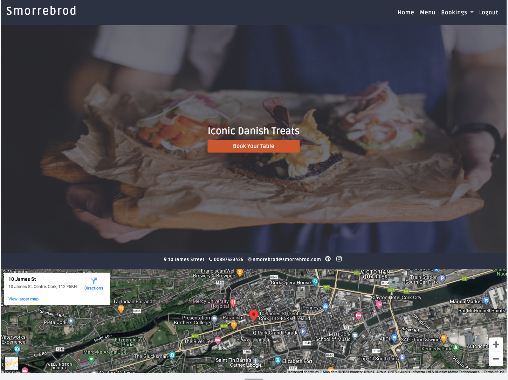
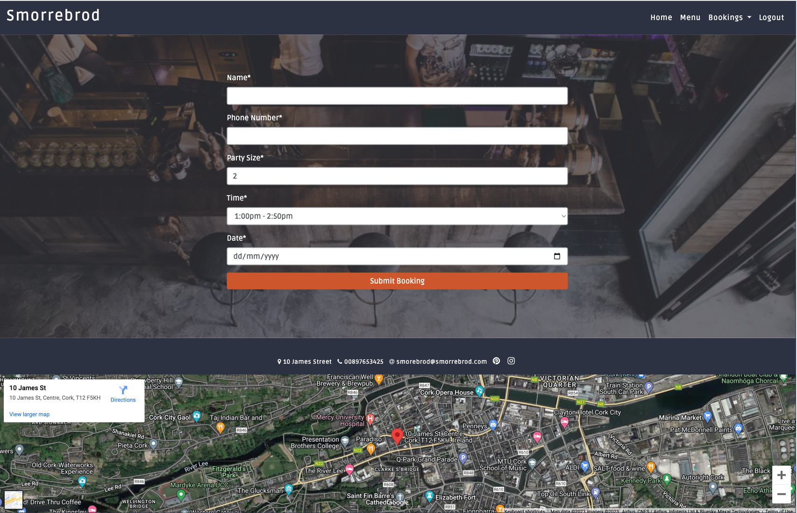
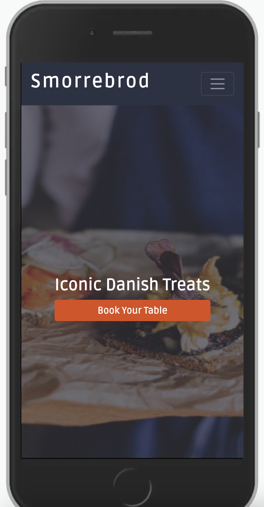
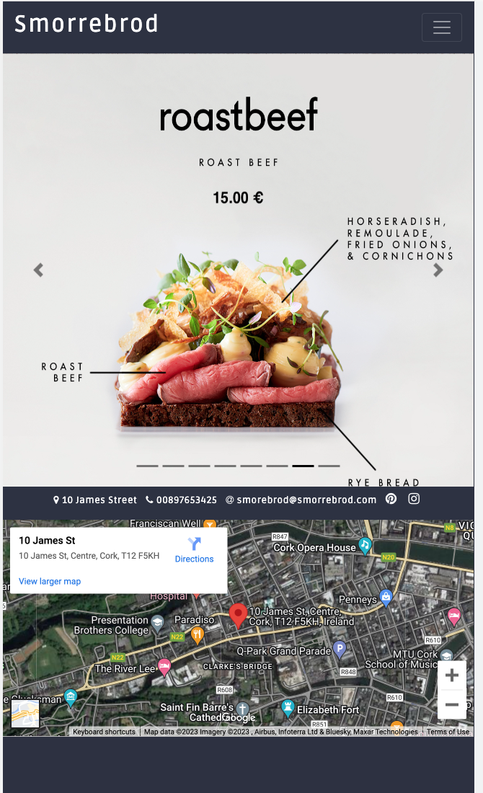

This is a fictional Gastro-Bar based in Cork city, Ireland.
Website is a booking management system, where customers can easily make bookings, edit and delete them. Staff has edit, delete and can view customers bookings and prepare tables for specific time and date.

## Using Agile Methods 

This project was developed using agile methodologies by delivering small features in sprints. There were 3 sprints, spaced out evenly over 5 weeks.

The Kanban board was created using github projects and can be located <a href="https://github.com/users/friaf/projects/12" target="_blank">here</a> and can be viewed to see more information on the project cards. 

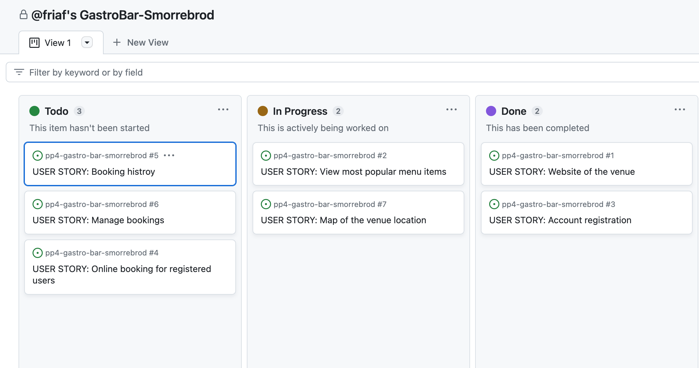
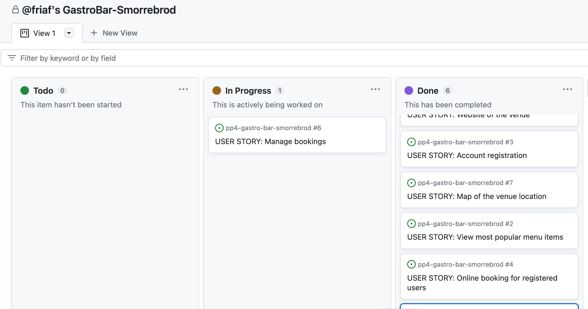
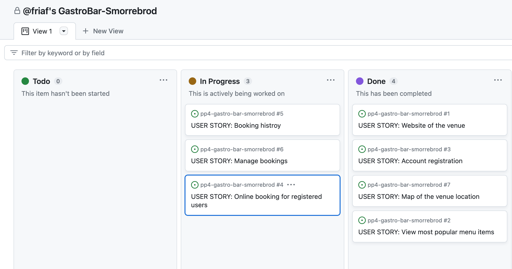

## Color Scheme

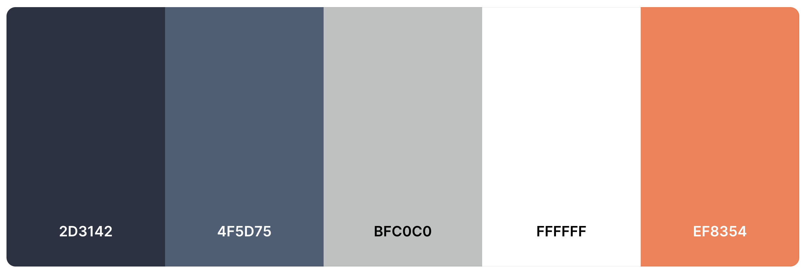

## Wireframes Plane
### Home page
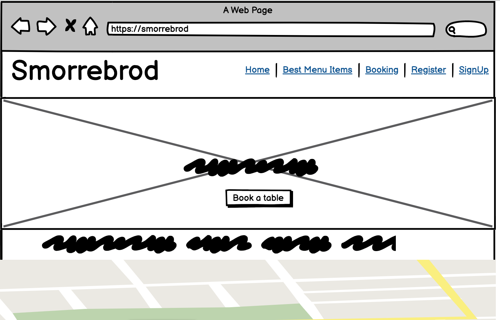
### Menu page
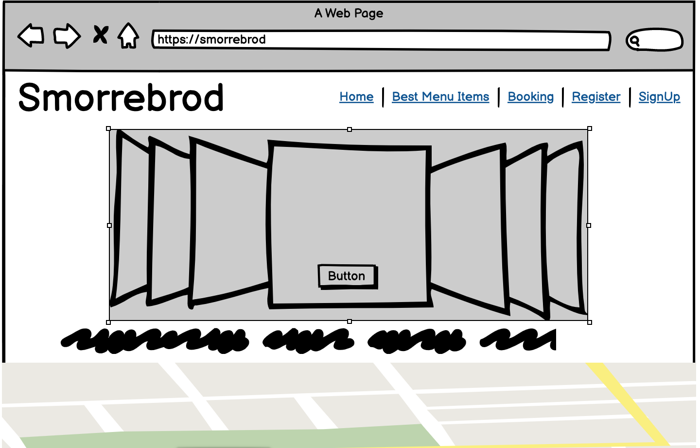
### Register page
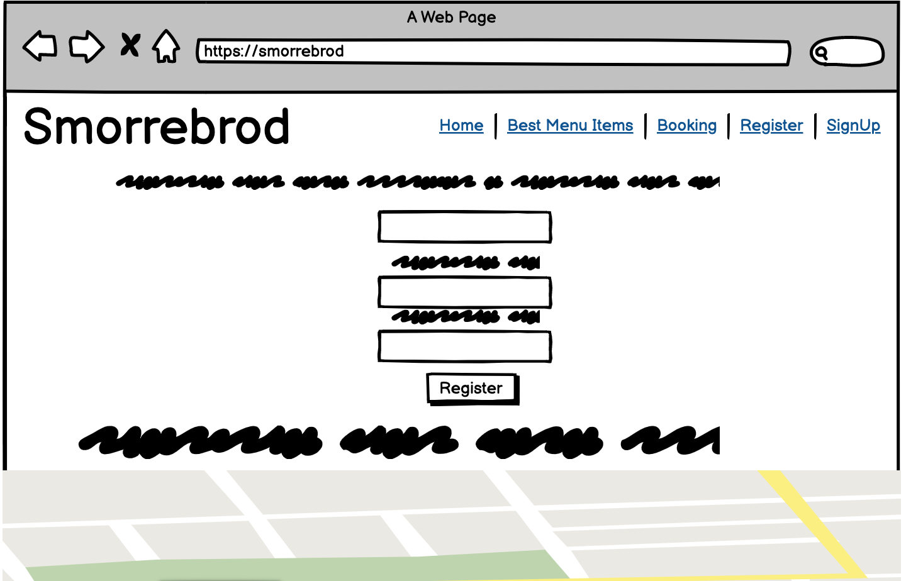
### Booking page
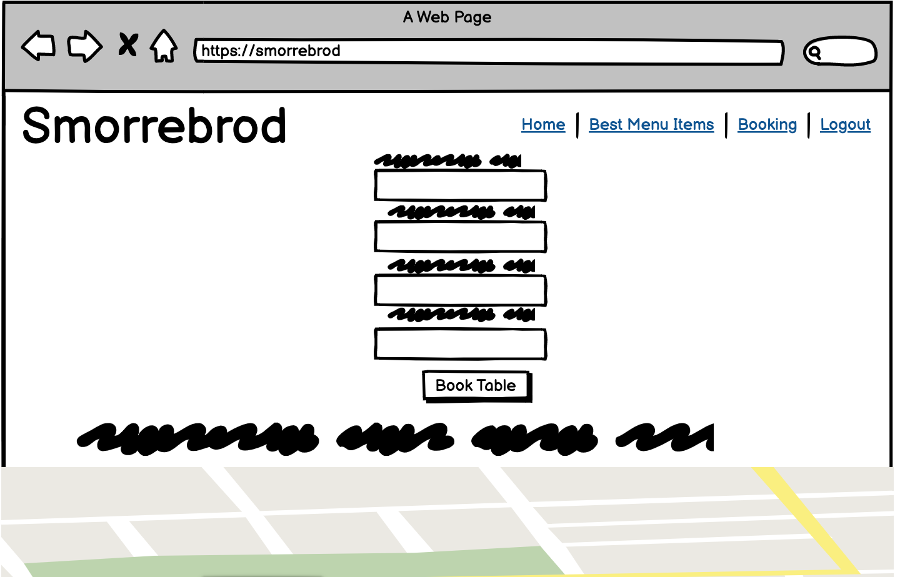
### Manage booking page
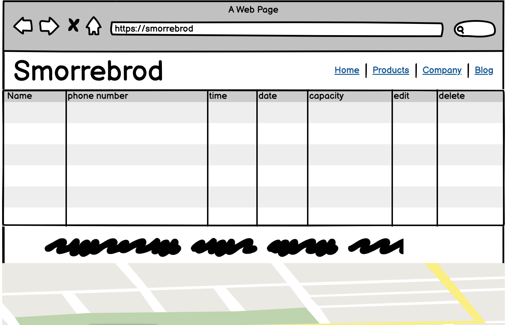
### Delete booking page
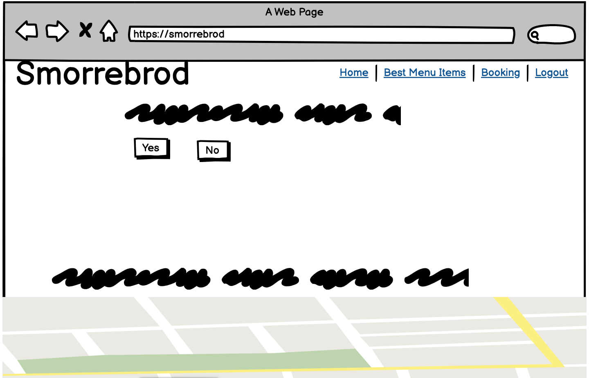

## Technolgies

- HTML
- CSS
- avaScript
- Python (Django Framework)
- Gitpod
- Github
- Git
- Fontawesome
- Favicon
- Balsamiq
- Google Fonts

### External Python Modules

- asgiref==3.6.0
- click==6.7
- cloudinary==1.33.0
- cursor==1.1.0
- dj-database-url==0.5.0
- dj3-cloudinary-storage==0.0.6
- Django==3.2.19
- django-admin-rangefilter==0.10.0
- django-allauth==0.54.0
- django-bootstrap-datepicker-plus==5.0.3
- django-crispy-forms==1.14.0
- django-tempus-dominus==5.1.2.17
- gunicorn==20.1.0
- oauthlib==3.2.2
- psycopg2==2.9.6
- pydantic==1.10.7
- PyJWT==2.7.0
- python3-openid==3.2.0
- pytz==2023.3
- requests-oauthlib==1.3.1
- sqlparse==0.4.4
- tempus==1.1.0
- urllib3==1.26.15
- whitenoise==6.4.0

## Deployment

The following git commands were used throughout development to push code to the remote repo:

git add . - This command was used to add the file(s) to the staging area before they are committed.

git commit -m “commit message” - This command was used to commit changes to the local repository queue ready for the final step.

git push - This command was used to push all committed code to the remote repository on github.

## Heroku Deployment

## The site was deployed to Heroku. The steps to deploy are as follows:

- Navigate to heroku and create an account
- Click the new button in the top right corner
- Select create new app
- Enter app name
- Select region and click create app
- Go to the settings tab and then click reveal config vars
- Add the following config vars:
  - SECRET_KEY: (Your secret key)
  - DATABASE_URL: (database url)
  - CLOUNDINARY_URL: (cloudinary api url)
  - PORT: (PORT)
  - HEROKU_POSTGRESQL_PUCE_URL: (postgres api url)
- Click the deploy tab
- Scroll down to Connect to GitHub and sign in / authorize when prompted
- In the search box, find the repositoy you want to deploy and click connect
- Scroll down to Manual deploy and choose the main branch
- Click deploy
The app should now be deployed.

The live link can be found here: <a href="https://pp4-gastro-bar-smorrebrod.herokuapp.com/" target="_blank">Live Site</a>

